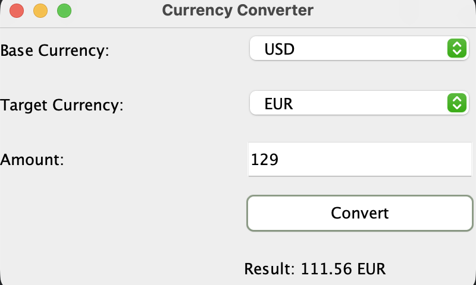

# 💱 Java Currency Converter

A simple **Currency Converter** built using **Java Swing** for the user interface and **ExchangeRate-API** for live exchange rates.

---

## 🚀 Features
- Convert between real-world currencies using live exchange rates  
- Fetches rates automatically from the [ExchangeRate API](https://www.exchangerate-api.com/)  
- Simple and clean Swing-based desktop interface  
- Validates numeric input (no negatives or invalid numbers)

---

## 🧩 Tech Stack
- **Language:** Java  
- **UI Framework:** Swing  
- **HTTP Client:** `java.net.http.HttpClient` (Java 11+)  
- **JSON Parser:** Gson  
- **API:** [ExchangeRate-API](https://www.exchangerate-api.com/)  

---

## ⚙️ Setup

### 1. Clone the repository
```bash
git clone https://github.com/SiPoo8/currency-converter.git
cd currency-converter
```

### 2. Open in IntelliJ IDEA
- Choose **Open Project**
- Select the folder
- Wait for dependencies to load

### 3. Add your API key
In `CurrencyService.java`, replace your API key:
```java
private final String apiKey = "YOUR_API_KEY_HERE";
```
Get one for free at [exchangerate-api.com](https://www.exchangerate-api.com/).

### 4. Run the application
Run the `CurrencyConverterUI` class — the converter window will appear.

---

## 🪄 Example Usage
1. Choose the base currency (e.g., **USD**)  
2. Choose the target currency (e.g., **EUR**)  
3. Enter an amount  
4. Click **Convert** — see instant results  

---

## 📦 Project Structure
```
src/
└── main/
    └── java/
        └── com/
            └── converter/
                ├── CurrencyConverterApp.java
                ├── CurrencyConverterUI.java
                └── CurrencyService.java
```

---

## 🧠 Learning Purpose
This project is designed for educational purposes — to demonstrate:
- Swing UI design  
- API integration in Java  
- Basic data handling with Gson and HttpClient  

---

## 🖼️ Screenshot



---

## 🪪 License
This project is open source and available under the [MIT License](LICENSE).
